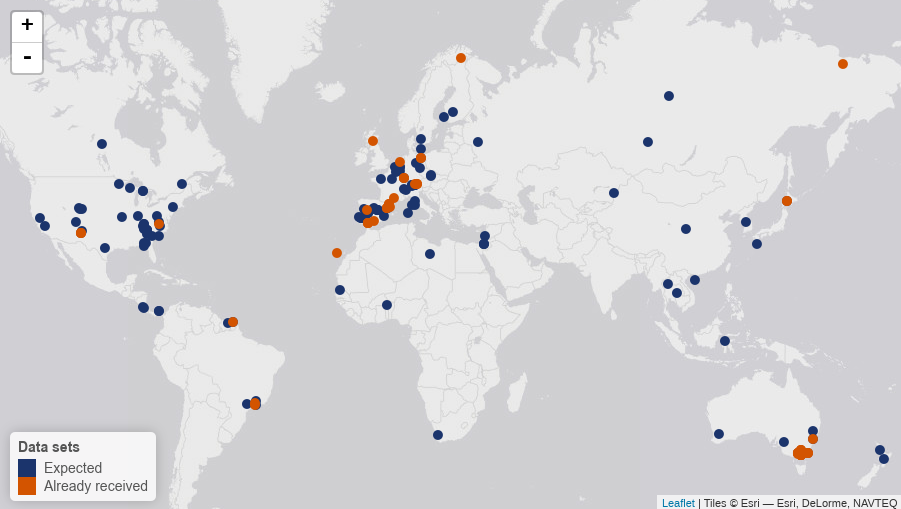

---
output:
  beamer_presentation:
    theme: "Madrid"
    colortheme: "dolphin"
    fonttheme: "structuresmallcapsserif"
    latex_engine: xelatex
    slide_level: 2
    fig_caption: false
    df_print: kable
    includes:
      in_header: mystyle.tex
      before_body: title.tex
---

```{r setup, include=FALSE}
knitr::opts_chunk$set(echo = FALSE)
```

## Introduction

\begin{columns}[T]
\begin{column}{.42\textwidth}

\includegraphics[height=5cm,width=5cm]{sapflow_diagram.pdf}

\end{column}%
\hfill%
\begin{column}{.54\textwidth}

\vspace{5mm}
{\large Proxy of the movement of water between the soil-plant-atmosphere continuum.\\}
\vspace{5mm}
{\large Different \textbf{thermodynamic methods} to determine sap flow using heat as a tracer sap movement\\}
\vspace{5mm}
{\large Allows \textbf{upscaling} from stem to plant and landscape level.}

\end{column}%
\end{columns}

## The time is ripe for a global database

The **SAPFLUXNET** initiative is building the first global database of
plant-level sap flow measurements to analyse the environmental and physiologycal
factors driving tree- and stand-level transpiration



## Target datasets

- Stem or whole-plant level
- Field conditions
- Sub-daily intervals
- Environmental data available (RH, Ta, PAR...)
- Abundant metadata (site, stand, plant, species and environmental)

## Data Characteristics

High data complexity:

\begin{columns}[T]
\begin{column}{.33\textwidth}

\vspace{4mm}
\begin{table}
\begin{tabular}{lr}
Metadata & Items\\
\hline
Site & 20\\
Stand & 16\\
Species & 4\\
Plant & 24\\
Environmental & 16\\
\hline
\hline
\textbf{Total} & \textbf{80}\\
\end{tabular}
\end{table}

\end{column}%
\hfill%
\begin{column}{.60\textwidth}

\includegraphics{methods_plot.pdf}

\end{column}%
\end{columns}  

---

## 

### How to assay quality and store data?

We need **semi-automatic**, **reproducible** and **robust** checks to ensure the quality of
the submmited datasets. Also, we need to store the data in a way that allows
all essential information to be **available** in order to use the data in checks
and analyses

## SAPFLUXNET Server Structure

\centering


## SAPFLUXNET Work Flow

\centering


## SAPFLUXNET Work Flow

\begin{columns}[T]
\begin{column}{.48\textwidth}

\includegraphics{general_schema_grayed.pdf}

\centering
\end{column}%
\hfill%
\begin{column}{.48\textwidth}

\vspace{10mm}
\begin{itemize}
  \item Automatic Quality Control checks (QC)
  \item Automatic report generation
  \item Storing data in special object (SfnData S4 class)
  \item Interactive functions allowing fine control of QC
\end{itemize}

\end{column}%
\end{columns}  

## SAPFLUXNET Work Flow

\begin{columns}[T]
\begin{column}{.48\textwidth}

\includegraphics{general_schema_grayed.pdf}

\centering
\end{column}%
\hfill%
\begin{column}{.48\textwidth}

\vspace{10mm}

Benefits of R as development environment

\begin{itemize}
  \item Open
  \item Reproducible
  \item Easy maintenance and update
  \item Easy integration with web and SQL technologies
\end{itemize}

\end{column}%
\end{columns}  

## SAPFLUXNET SfnData S4 Class

S4 classes:

- Easy way of store complete site data
- Validity checks based in fair assumptions
- Methods: `[]`, `get`, `<-`
- Scalable: allows for combining sites for more complex analyses (**whishlist**)

SfnData class:

\centering
\includegraphics[height=5cm,width=10cm]{SfnData_schematics.pdf}

## SAPFLUXNET Data Flow

\centering
\includegraphics{QC1_process.pdf}

## SAPFLUXNET Data Flow

\centering
\includegraphics{QC2_process.pdf}

## SAPFLUXNET Status File

\begin{columns}[T] % align columns
\begin{column}{.50\textwidth}

\centering
\includegraphics{status_file.pdf}

\end{column}%
\hfill%
\begin{column}{.48\textwidth}
\textbf{How to track site status?}\\
\vspace{5mm}
Status file in yaml format:\\

\begin{itemize}
  \item Known standard (i.e. used as headers in Rmarkdown)
  \item Easy to import/export in R 
  \item Fast method to know the status
\end{itemize}

\end{column}%
\end{columns}

## SAPFLUXNET Apps

### Control center
\centering
\includegraphics{sfn_monitor.pdf}

## SAPFLUXNET Apps

### Progress dashboard
\centering
\includegraphics{progress_dashboard.pdf}

##

\centering
\includegraphics{orly_contribute.png}
